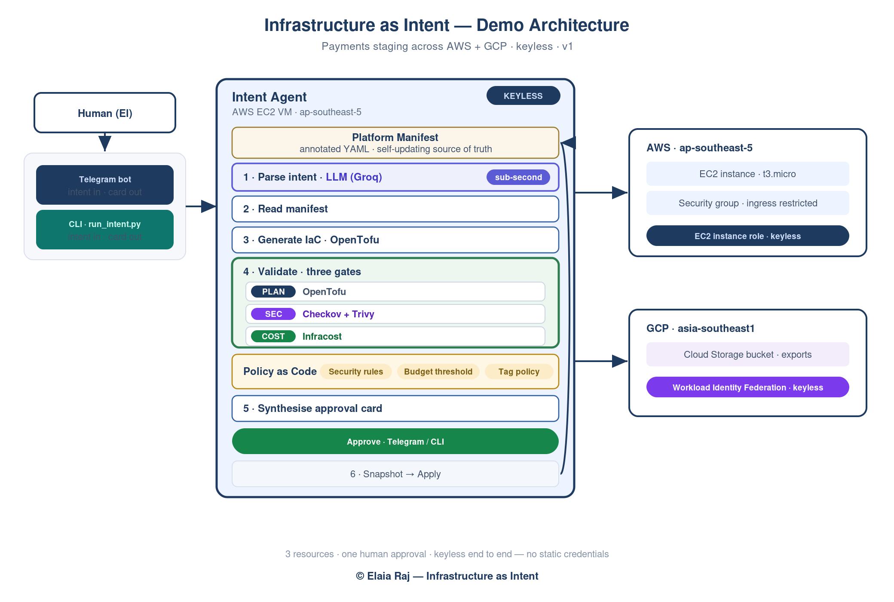
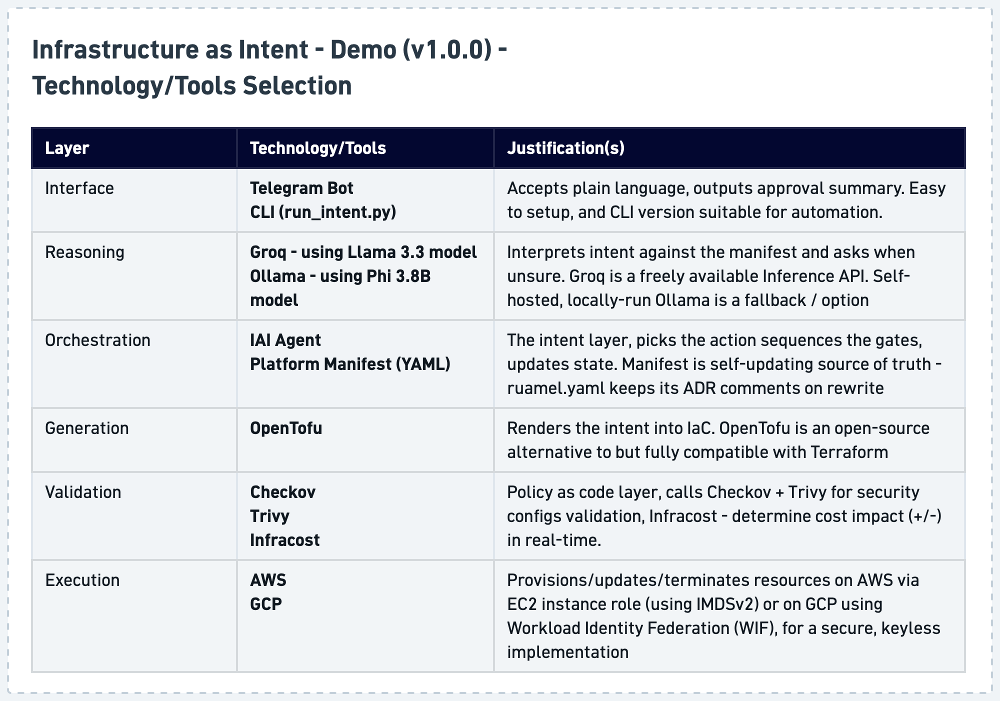

# How the IAI demo works

Infrastructure as Intent (IAI) puts an **intent layer** above the usual infrastructure-as-code tools. A human states an outcome in plain language; an AI agent interprets it, generates the infrastructure, validates it, and asks for a single approval before anything is applied. The agent is the orchestrator — the tools underneath are interchangeable execution engines. This is *not* a Terraform wrapper.

This document explains what the demo does end to end, the tools it uses, how they integrate, and why each was chosen. For setup, see [`GETTING_STARTED.md`](../GETTING_STARTED.md).

---

## End-to-end flow

A request travels through one straight pipeline with exactly one human decision in the middle:

1. **Intent.** A plain-language request arrives via Telegram or the CLI — for example, *"Set up the payments staging environment."* The manifest already knows what that environment contains, so the user doesn't restate it. No code, no console.
2. **Parse + reason.** An LLM interprets the request *against the platform manifest* and decides an action: provision, modify, destroy — or **clarify**. If the request is ambiguous it asks one short question and waits, rather than guessing. The conversation is remembered, so your answer composes with what you already said. Inference uses a deliberate fallback chain — **Groq (Llama 3.3 70B)** for sub-second hosted reasoning by default, a **local Ollama model (Phi 3.8B)** if no hosted key is set, and a keyword parser if neither is reachable — so the agent stays self-hostable and never hard-fails.
3. **Read the manifest.** The agent consults the manifest — the source of truth for what already exists and which engine owns each resource — instead of guessing.
4. **Generate.** It writes OpenTofu for the requested resources across AWS and GCP.
5. **Three gates — detect *and* fix.** A plan (what changes), a security scan (Checkov + Trivy), and a cost estimate (Infracost) all run automatically. The security gate doesn't only flag: when it catches the app-tier security group left open to the internet (`0.0.0.0/0`), the agent **rewrites the generated code to narrow that ingress to a private range, then re-runs the gate to confirm the fix cleared the finding.** The card's "caught and fixed" is therefore true of the configuration that will actually be applied — not a claim about what was generated. The cost gate prices what was generated.
6. **One card.** All three gate results are folded into a single plain-language approval card. A decision, not a wall of raw tool output.
7. **Human approves.** Nothing is applied before the tap.
8. **Apply, keyless.** State is snapshotted, then OpenTofu applies — AWS via the EC2 instance role, GCP via Workload Identity Federation. No static cloud credentials anywhere.
9. **Self-updating manifest.** After a clean apply the agent rewrites the manifest with the new reality and the reasoning behind it. On teardown, the card also shows the monthly cost that stops being billed.

---

## The stack, layer by layer

Each layer is a swappable engine under the same intent layer. The table below records what each tool does and why it was selected over the alternatives.

| Layer | Tool | Why this, and not the alternative |
|---|---|---|
| Interface | **Telegram bot** + **CLI** (`python-telegram-bot`) | Telegram is a zero-setup approval UI that works on any phone — no web app to host. The CLI (`run_intent.py`) gives the same pipeline for headless and CI use, and makes the project runnable with no messaging infrastructure at all. |
| Reasoning | **Groq** (Llama 3.3 70B), with **Ollama / Phi 3.8B** as a local fallback | The intent parse was the slowest beat on a purely local model (~60–90s on Ollama / Phi 3.8B). Groq's LPU returns the same result sub-second on a free tier with no credit card. The provider chain is intentional — **Groq → local Ollama (Phi 3.8B) → keyword passthrough** — so the agent is fast by default, fully self-hostable offline, and never a hard failure if a key or the network is missing. Because the endpoint is OpenAI-compatible, swapping to Cerebras or OpenAI is a one-line env change. |
| Orchestration | **IAI Agent** + **Platform Manifest** (annotated YAML via `ruamel.yaml`) | The manifest is human-readable and ADR-style — it records *why*, not just specs — and it is self-maintaining: the agent reads it to generate and rewrites it after apply. `ruamel.yaml` is used specifically because it preserves the human comments through that machine rewrite, which a plain YAML loader would strip. |
| Generation | **OpenTofu** | Open-source (MPL) and a drop-in for Terraform's language. It avoids Terraform's BSL licensing concerns for a tool that orchestrates other IaC, and it is on-brand: an open intent layer over an open engine. The whitepaper keeps "Terraform" as the generic term and the one approved phrase "not a Terraform wrapper." |
| Validation (Policy as Code) | **Checkov** + **Trivy** (security) · **Infracost** (cost) | Three gates run before any human sees a change. Checkov is the primary policy engine with Trivy as a second scanner (tfsec was dropped — it's deprecated and folded into Trivy). Infracost prices the generated resources. The security gate doesn't just flag — when it catches the open-ingress misconfiguration the agent rewrites the IaC to fix it and re-scans to confirm, so "caught and fixed" is verified, not asserted. Gate accuracy is the trust contract: the human approves the agent's summary, so a gate that misses a bad config or misstates cost breaks the whole premise. |
| Execution (keyless) | **AWS** (EC2 instance role / IMDSv2) · **GCP** (Workload Identity Federation) | The agent holds no static cloud keys. AWS credentials come from the VM's instance role; GCP is federated to that same role via WIF. There is nothing to leak and nothing to rotate — the strongest posture available, and the simplest for others to reproduce safely. |

---

## How the pieces integrate

The agent is a small Python orchestrator; every tool is invoked at a defined seam, which is what makes them swappable:

- **Interface → agent.** Telegram and the CLI are thin front-ends. Both call the same `process_intent()` entry point, so the bot and the CLI behave identically (including the clarify dialogue).
- **Agent → LLM.** `agent/llm_client.py` owns provider selection and the reasoning prompt. The manifest is injected into the prompt at call time, so the model reasons about *what actually exists*. Any failure degrades safely to a keyword passthrough, so the pipeline never hard-fails.
- **Agent → OpenTofu.** `agent/iac_generator.py` renders HCL from the manifest into `terraform/generated/`; the gates and the apply both run against that directory.
- **Agent → gates.** Each gate (`gates/plan_gate.py`, `security_gate.py`, `cost_gate.py`) is a standalone module the pipeline calls and whose output it synthesizes. Cost runs Infracost live by default; set `IAI_INFRACOST_FIXTURE` to use a saved estimate for offline/deterministic runs.
- **Agent → clouds.** OpenTofu inherits the VM's keyless credentials automatically (instance role for AWS, WIF for GCP), so the same `tofu apply` reaches both clouds with no secrets in the chain.

The result is a system where the *intent* — the reasoning about what the business wants — lives in one place, and the *execution* engines below it can be replaced without touching that reasoning. That separation is the whole idea.

---

## Honest scope (v1.0.0)

The demo provisions a deliberately small set — an AWS EC2 instance + security group and a GCP Cloud Storage bucket (3 resources) — chosen to exercise every part of the pipeline (multi-cloud, a real security catch, live cost, criticality, keyless apply, self-updating manifest) while staying fast to build and tear down. The Ansible / physical-hardware engine is declared in the manifest but out of scope; image baking / CI is upstream; and the clarification dialogue resolves in a few turns rather than holding long-term memory. These are scope choices for v1.0.0, not limits of the model.
